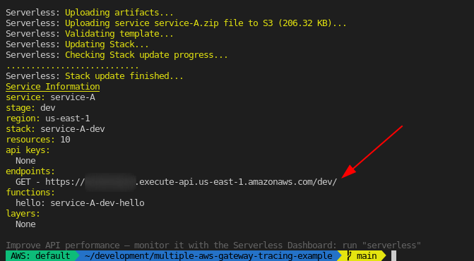
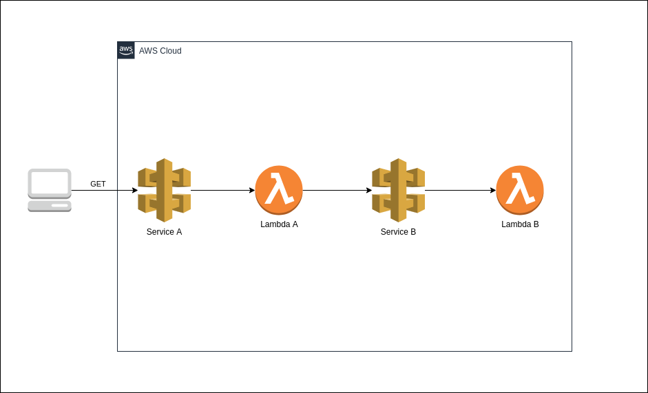
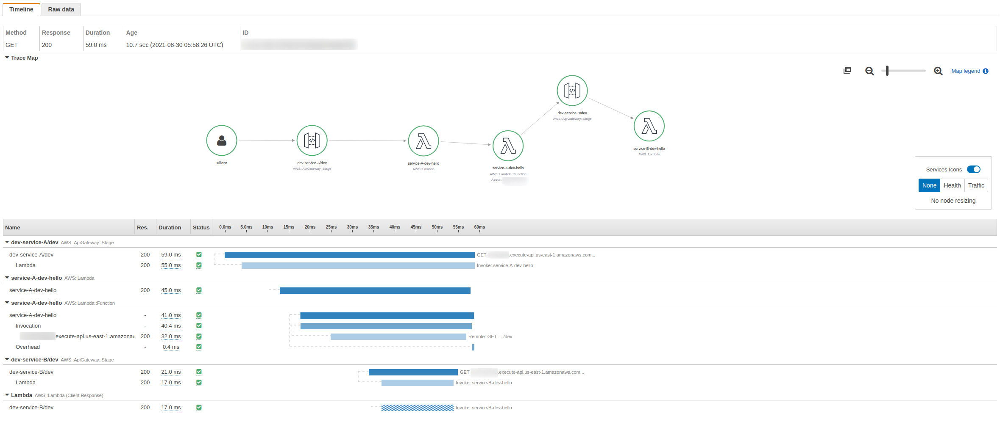

# AWS X-Ray Multi API Gateway Tracing Example

> Example showing how to pass a tracing header between API Gateways **with AWS X-Ray SDK instrumentation** using [Serverless Framework](https://serverless.com/) and Node.js

## Requirements

1. Node.js v10.x or greater
2. AWS CLI Profile

## Getting Started

Begin by deploying the infrastructure by running the deploy script.

```bash
./deploy.sh
```

After it has finished deploying, send traffic to the endpoint on service A displayed
in your terminal to begin generating traces.



Then open the [traces tab for X-Ray in the AWS Console](https://console.aws.amazon.com/xray/home#/traces).

## Architecture



## Trace Example



## Cleanup

Run the cleanup script when you are finished to remove all created resources.

```bash
./cleanup.sh
```

## Security

See [CONTRIBUTING](CONTRIBUTING.md#security-issue-notifications) for more information.

## License

This library is licensed under the MIT-0 License. See the LICENSE file.

